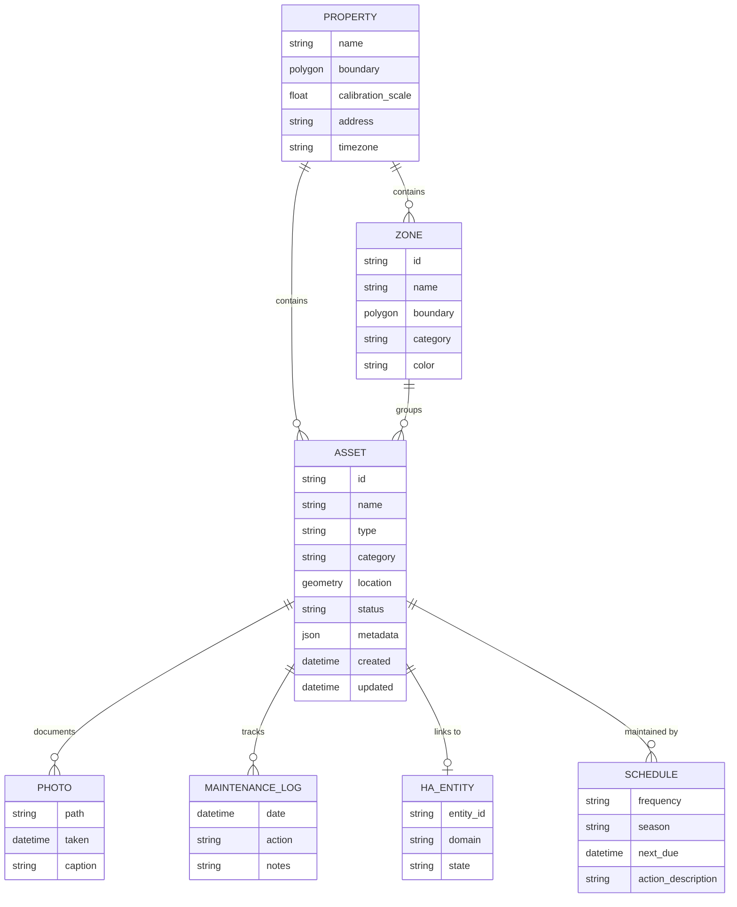
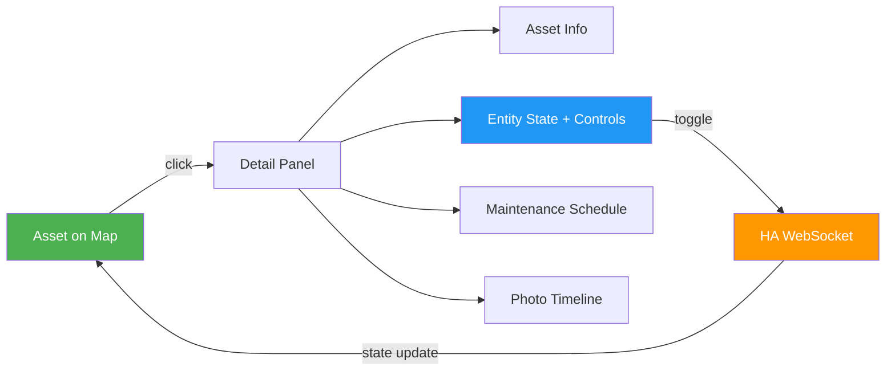
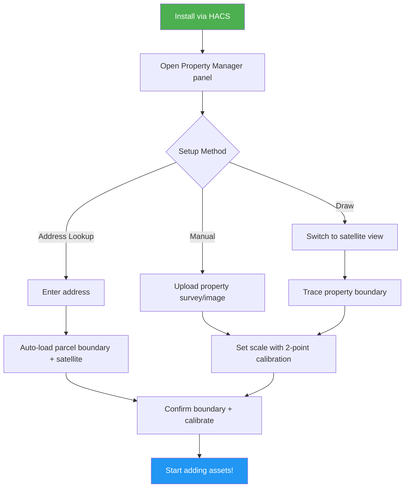
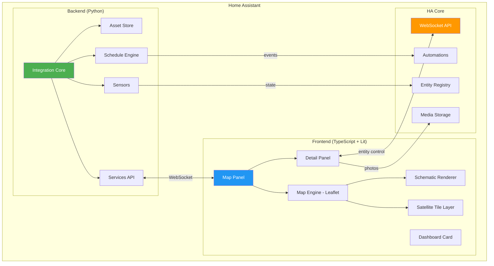

# Home Assistant Property Manager

**Status:** Planning  
**Created:** April 28, 2026  
**Type:** Home Assistant custom integration + frontend panel (HACS)  
**License:** Open source (MIT or Apache 2.0)

---

## Vision

An interactive property map inside Home Assistant where homeowners can plot, track, and monitor everything on their property — fences, trees, sprinkler zones, pest traps, paths, garden beds, utility lines, lighting, and more. A spatial layer for your home automation that ties physical location to monitoring, maintenance, and HA entity control.

Think GIS-lite purpose-built for residential properties, deeply integrated with Home Assistant.

## The Problem

Homeowners track property information across:
- Mental memory ("I think the sprinkler valve is somewhere over there")
- Paper notes and filing cabinets
- Random phone photos with no context
- Scattered HA entities with no spatial awareness
- Google Maps screenshots with hand-drawn annotations

No single tool ties **physical location → asset tracking → monitoring → automation** for residential properties. Home Assistant has powerful automation but zero spatial awareness of the property itself.

### What Exists Today

| Tool | Limitation |
|------|-----------|
| HA Device Tracker Map | People/device locations only, not property assets |
| HA Zones | Simple circles, no asset management |
| Floor Plan Cards | Indoor only, static images |
| Google My Maps | No HA integration, no automation, no maintenance tracking |
| Commercial GIS | Enterprise pricing, massive overkill |
| Pen and paper | Doesn't automate anything |

**Property Manager fills the gap between "I know where my stuff is" and "my house knows where my stuff is."**

---

## Core Concepts

### The Property Map

Two rendering modes for the interactive map:

**Schematic View (Default)**
- Clean, stylized vector rendering — flat colors, clean shapes, icons
- Think: architectural site plan or a game-style top-down map
- Color-coded by category (green = landscaping, blue = water, yellow = pest control, etc.)
- Lightweight, fast, works great on tablets and phones
- Property boundary drawn to scale — **relative sizes of all elements must be spatially accurate**
- No internet dependency (fully local rendering)

**Satellite View**
- Real aerial/satellite imagery as the base layer
- Assets overlaid on top with semi-transparent styling
- Source: OpenStreetMap tiles (default), Mapbox, ESRI, or manual image upload
- Great for initial setup (trace your property from real imagery)
- Useful for sharing with contractors, landscapers, pest control

**Both views share the same spatial data.** Assets placed in satellite view appear correctly in schematic view and vice versa. The coordinate system is consistent — if your deck is 20ft wide in satellite view, it's 20ft wide in schematic view.

### Spatial Accuracy

**This is critical.** The map is only useful if relative sizes and positions are accurate.

- **Calibration step during setup:** User marks two known points and provides the real-world distance between them (e.g., "front corners of my house are 48 feet apart"). All subsequent measurements reference this calibration.
- **Alternative:** Import parcel boundaries from county GIS data (many counties provide free parcel shapefiles). The system auto-calibrates from the parcel dimensions.
- **Scale indicator** always visible on the map (like Google Maps' distance bar)
- **Measurement tool:** Click two points → see real distance. Draw a polygon → see real area.
- **Snap-to-grid** option for precise placement
- **Ruler overlay** toggle for checking spacing

### Assets

Everything on the property map is an **asset** — a typed, trackable, spatial entity.



**Asset geometry types:**
- **Point** — traps, trees, valves, outlets, sensors
- **Line** — fence runs, pipe routes, cable paths, property edges
- **Polygon** — deck, garden bed, lawn zone, play area, driveway

### Asset Categories

| Category | Icon | Color | Examples |
|----------|------|-------|----------|
| Structures | 🏗️ | Gray | Deck, shed, fence, retaining wall, pergola |
| Landscaping | 🌳 | Green | Trees, garden beds, lawn zones, hedges |
| Water | 💧 | Blue | Sprinkler heads, valves, zones, hose bibs, drainage |
| Utilities | ⚡ | Orange | Electrical outlets, gas lines, cable runs, junction boxes |
| Pest Control | 🪤 | Yellow | Wasp traps, ant bait, rodent stations, spray zones |
| Paths & Access | 🚶 | Brown | Walkways, driveways, gates, stairs |
| Lighting | 💡 | Amber | Outdoor lights, solar stakes, motion sensors |
| Recreation | 🎪 | Purple | Play structures, fire pit, pool, trampoline |
| Vehicles | 🚗 | Slate | Parking spots, EV charger, garage zones |
| Custom | 📌 | User-defined | Anything else |

Categories are extensible — users can add their own with custom icons and colors.

---

## HA Entity Integration

The killer feature: **click any asset on the map and interact with the linked HA entity.**

### How It Works

Any asset can optionally link to one or more HA entities. When linked:

- **The asset marker reflects entity state** (sprinkler head turns blue when zone is active, light glows when on)
- **Clicking the asset opens a detail card** showing:
  - Asset info (name, type, metadata, photos)
  - Linked entity state + controls (toggle switch, brightness slider, etc.)
  - Maintenance schedule + history
  - Quick actions (mark as checked, log event, take photo)
- **Entity state changes update the map in real-time** via HA WebSocket



### Example: Sprinkler Zone

1. User draws a polygon for "Front Lawn Zone"
2. Links it to `switch.rachio_zone_1`
3. On the map: polygon is green (off) or blue (active)
4. Click the zone → see runtime today, next scheduled run, toggle on/off
5. Maintenance: "Check heads for clogs — every 3 months"

### Example: Outdoor Light

1. User places a point for "Driveway Floodlight"
2. Links it to `light.driveway_flood`
3. On the map: light icon glows when entity is on
4. Click → brightness slider, color temp, toggle, automation schedule
5. Maintenance: "Replace bulb — every 2 years"

### Example: Pest Trap

1. User places a point for "Yellowjacket Trap - NW Corner"
2. No HA entity linked (it's passive hardware)
3. Click → bait type, date set, last checked, catch log
4. Maintenance: "Check and clean — every 2 weeks, Apr-Oct"
5. Seasonal automation: "Swap to sweet bait — June 1"

---

## User Experience

### First-Time Setup Flow



### Map Interaction

**Drawing Tools (via toolbar):**
- 📍 Place point asset
- ✏️ Draw line asset
- ⬡ Draw polygon asset
- 📏 Measure distance/area
- 🔲 Select and edit existing asset
- 🗑️ Delete asset

**Navigation:**
- Pan, zoom, pinch (touch-friendly)
- Toggle schematic/satellite view
- Toggle category layers on/off
- Search assets by name/type
- Filter by status (needs attention, overdue, all)

### Detail Panel (Click Any Asset)

```
┌─────────────────────────────────┐
│ 🪤 Yellowjacket Trap - NW       │
│ Category: Pest Control           │
│ Status: ✅ Active                │
├─────────────────────────────────┤
│ Bait: Protein (chicken)          │
│ Placed: Apr 28, 2026            │
│ Last Checked: --                 │
│ Next Check: May 12, 2026        │
├─────────────────────────────────┤
│ 📸 Photos (0)    [Add Photo]    │
├─────────────────────────────────┤
│ 📋 Maintenance Log              │
│ (empty)                          │
├─────────────────────────────────┤
│ [✓ Mark Checked] [Edit] [Delete]│
└─────────────────────────────────┘
```

For HA-linked assets, the entity controls appear inline:

```
┌─────────────────────────────────┐
│ 💧 Front Lawn Sprinkler Zone    │
│ Category: Water                  │
│ Status: ✅ Active                │
├─────────────────────────────────┤
│ 🔗 switch.rachio_zone_1         │
│ State: OFF                       │
│ [  ○─────────── Toggle ]        │
│ Last Run: Apr 27 (12 min)       │
│ Next Run: Apr 29, 5:00 AM       │
├─────────────────────────────────┤
│ Coverage: ~800 sq ft             │
│ Heads: 4 (linked below)         │
├─────────────────────────────────┤
│ 📋 Maintenance                  │
│ ⏰ Check heads — Due May 28     │
│ ⏰ Winterize — Due Oct 15       │
├─────────────────────────────────┤
│ [✓ Mark Checked] [Edit] [Delete]│
└─────────────────────────────────┘
```

### Dashboard Card (Lovelace)

A summary card for the main HA dashboard:

```
┌─────────────────────────────────┐
│ 🏡 Property Manager             │
│                                  │
│ ⚠️  3 items need attention       │
│ 🪤 2 traps due for check        │
│ 💧 1 sprinkler head clogged     │
│                                  │
│ 📅 Upcoming                     │
│ May 1 — Swap trap bait (summer) │
│ May 12 — Check all traps        │
│ May 15 — Fertilize front lawn   │
│                                  │
│ 34 assets · 8 linked entities   │
│           [Open Map →]           │
└─────────────────────────────────┘
```

---

## Architecture

### System Overview



### Repository Structure

```
ha-property-manager/
├── custom_components/
│   └── property_manager/
│       ├── __init__.py              # Integration setup + platform registration
│       ├── manifest.json            # HACS manifest
│       ├── config_flow.py           # Setup wizard (address, calibration)
│       ├── coordinator.py           # Data update coordinator
│       ├── models.py                # Asset, Zone, Schedule data models
│       ├── store.py                 # Persistent storage (HA .storage JSON)
│       ├── services.py              # Service handlers (add/edit/remove assets)
│       ├── services.yaml            # Service definitions
│       ├── sensor.py                # Sensor platform (attention count, etc.)
│       ├── calendar.py              # Calendar platform (maintenance schedule)
│       ├── schedule_engine.py       # Maintenance scheduling + seasonal rules
│       ├── gis.py                   # Parcel data import, coordinate math
│       ├── const.py                 # Constants, categories, defaults
│       ├── strings.json             # Localization
│       └── translations/
│           └── en.json
├── frontend/
│   ├── src/
│   │   ├── property-map-panel.ts    # Main panel entry point
│   │   ├── map-engine.ts            # Leaflet wrapper + layer management
│   │   ├── schematic-renderer.ts    # Vector/stylized view renderer
│   │   ├── satellite-layer.ts       # Tile layer management
│   │   ├── drawing-tools.ts         # Point/line/polygon creation
│   │   ├── asset-detail.ts          # Click-to-inspect detail panel
│   │   ├── entity-controls.ts       # Inline HA entity state + controls
│   │   ├── asset-editor.ts          # Add/edit asset dialog
│   │   ├── layer-manager.ts         # Category layer toggles
│   │   ├── calibration-wizard.ts    # Scale calibration UI
│   │   ├── photo-timeline.ts        # Asset photo history
│   │   ├── dashboard-card.ts        # Lovelace summary card
│   │   ├── measurement-tool.ts      # Distance/area measurement
│   │   ├── models.ts                # TypeScript types
│   │   └── styles.ts                # Shared styles + category colors
│   ├── package.json
│   ├── tsconfig.json
│   └── rollup.config.js
├── tests/
│   ├── test_store.py
│   ├── test_models.py
│   ├── test_schedule.py
│   ├── test_gis.py
│   └── test_services.py
├── docs/
│   ├── setup.md
│   ├── asset-types.md
│   ├── entity-linking.md
│   └── screenshots/
├── hacs.json
├── README.md
├── LICENSE
└── CONTRIBUTING.md
```

### Data Model (Storage)

```json
{
  "version": 1,
  "property": {
    "name": "Home",
    "boundary": [[lat, lng], ...],
    "calibration": {
      "point_a": [lat, lng],
      "point_b": [lat, lng],
      "distance_meters": 14.63
    },
    "address": "123 Main St, Bellevue, WA 98004",
    "timezone": "America/Los_Angeles"
  },
  "assets": [
    {
      "id": "asset_abc123",
      "name": "Yellowjacket Trap - NW Corner",
      "type": "wasp_trap",
      "category": "pest_control",
      "geometry": {
        "type": "Point",
        "coordinates": [lat, lng]
      },
      "status": "active",
      "metadata": {
        "trap_model": "RESCUE! WHY Trap",
        "bait_type": "protein",
        "bait_detail": "chicken",
        "date_placed": "2026-04-28"
      },
      "linked_entities": [],
      "photos": [],
      "schedules": [
        {
          "id": "sched_001",
          "action": "Check and clean trap",
          "frequency": "14d",
          "season": { "start_month": 4, "end_month": 10 },
          "next_due": "2026-05-12"
        },
        {
          "id": "sched_002",
          "action": "Swap bait to sweet attractant",
          "frequency": "yearly",
          "season": { "start_month": 6, "end_month": 6 },
          "next_due": "2026-06-01"
        }
      ],
      "maintenance_log": [],
      "created": "2026-04-28T10:30:00-07:00",
      "updated": "2026-04-28T10:30:00-07:00"
    }
  ],
  "zones": [
    {
      "id": "zone_deck",
      "name": "Back Deck",
      "category": "structures",
      "geometry": {
        "type": "Polygon",
        "coordinates": [[[lat, lng], ...]]
      },
      "color": "#78909C",
      "metadata": {
        "material": "composite",
        "year_built": 2026
      }
    }
  ]
}
```

### Schematic View Rendering

The schematic view is a custom Canvas/SVG renderer (not map tiles). It draws assets using the same coordinate system as the Leaflet map but with stylized visuals:

**Rendering rules:**
- Property boundary: thick border with subtle fill
- Structures: solid fills with slightly darker outlines
- Landscaping: organic shapes with texture patterns (grass hatching, mulch dots)
- Water: blue-tinted with flow direction arrows for pipes
- Paths: dashed or dotted lines
- Points: category-colored circles with icons
- Scale bar always visible
- North arrow in corner

**Color palette (default, customizable):**

| Element | Fill | Stroke |
|---------|------|--------|
| Lawn/Grass | #81C784 | #66BB6A |
| Garden Bed | #A5D6A7 | #4CAF50 |
| Deck/Structure | #B0BEC5 | #78909C |
| Water/Sprinkler | #64B5F6 | #42A5F5 |
| Paths | #D7CCC8 | #A1887F |
| Driveway | #BDBDBD | #9E9E9E |
| Fence | #8D6E63 | #6D4C41 |
| Pest Control | #FFF176 | #FDD835 |
| Recreation | #CE93D8 | #AB47BC |

Users can customize the palette via integration options.

---

## Development Phases

### Phase 1: Core Map and Assets (MVP)

**Goal:** A working property map where users can plot assets with accurate spatial relationships.

- [ ] HACS integration scaffold (manifest, config flow, init)
- [ ] Leaflet.js map panel registered in HA sidebar
- [ ] Satellite tile layer (OpenStreetMap default)
- [ ] Property boundary setup with two options:
  - Draw boundary on satellite view
  - Enter address for auto-lookup (OpenStreetMap Nominatim)
- [ ] Two-point scale calibration system
- [ ] Scale bar + measurement tool
- [ ] Drawing tools: place points, draw lines, draw polygons
- [ ] Asset CRUD via HA services (add, update, remove, list)
- [ ] Category system with built-in types + custom types
- [ ] Layer toggle panel (show/hide categories)
- [ ] Basic asset detail panel (click to inspect)
- [ ] Persistent storage (.storage JSON)
- [ ] Basic Lovelace card (asset count + status summary)

**Deliverable:** Users can install via HACS, set up their property boundary, and start mapping assets with accurate scale.

### Phase 2: Schematic View and Styling

**Goal:** The stylized low-res view that makes the map actually pleasant to look at.

- [ ] Schematic renderer (Canvas or SVG overlay on Leaflet)
- [ ] Category-based color palette
- [ ] Icon set for common asset types
- [ ] Smooth toggle between schematic and satellite views
- [ ] Custom color palette support in integration options
- [ ] Print/export schematic view as PNG/SVG
- [ ] Responsive layout (mobile, tablet, desktop)

**Deliverable:** Two polished map views that share the same spatial data.

### Phase 3: HA Entity Integration

**Goal:** Click an asset, control the linked HA entity, see live state on the map.

- [ ] Entity linking UI (search + select HA entity per asset)
- [ ] Multi-entity support per asset (e.g., zone links to 4 sprinkler heads)
- [ ] Live state reflection on map (color/animation changes with entity state)
- [ ] Inline entity controls in detail panel (toggle, slider, select)
- [ ] Real-time updates via HA WebSocket subscription
- [ ] Entity domain-specific controls:
  - `switch.*` → toggle
  - `light.*` → toggle + brightness + color temp
  - `cover.*` → open/close/position
  - `sensor.*` → display value
  - `binary_sensor.*` → display state
  - `climate.*` → temperature + mode
  - `valve.*` → open/close

**Deliverable:** Property map becomes a spatial control panel for all outdoor HA entities.

### Phase 4: Maintenance and Scheduling

**Goal:** Proactive property maintenance with seasonal awareness.

- [ ] Maintenance schedules per asset (recurring + one-time)
- [ ] Seasonal rules (active months, seasonal task switching)
- [ ] HA calendar entity (property_manager.maintenance) showing upcoming tasks
- [ ] Automation triggers: `property_manager_maintenance_due` event
- [ ] Status tracking: good → due soon → overdue (with visual indicators on map)
- [ ] "Mark as done" action (logs event, advances next due date)
- [ ] Notification integration (HA persistent notification + companion app)
- [ ] Sensor entities: `sensor.property_manager_overdue_count`, `sensor.property_manager_due_soon_count`
- [ ] Seasonal presets: spring prep, summer maintenance, fall cleanup, winterization

**Deliverable:** The system proactively tells you what needs doing and when.

### Phase 5: Photos and History

**Goal:** Full documentation trail for every asset on the property.

- [ ] Photo attachment per asset (upload from browser or HA companion app)
- [ ] Photo timeline view (visual history per asset)
- [ ] Maintenance log with timestamps and notes
- [ ] Event logging for monitoring assets (e.g., "caught 3 yellowjackets" for traps)
- [ ] Before/after photo pairs
- [ ] Export property report (PDF or markdown summary of all assets + status)
- [ ] Asset timeline: combined view of photos + maintenance + events

**Deliverable:** Complete property documentation system with visual history.

### Phase 6: Smart Features and Polish

**Goal:** Intelligence layer and quality-of-life improvements.

- [ ] Visual overlays: sprinkler coverage radius, light cone coverage
- [ ] Coverage analysis: "these sprinkler zones overlap" or "this corner has no coverage"
- [ ] Weather-aware scheduling: skip outdoor maintenance if rain forecast (via HA weather entity)
- [ ] Asset templates: pre-configured types with default schedules (e.g., "Fruit Tree" includes prune schedule, fertilize schedule, harvest season)
- [ ] Bulk import: CSV/JSON import for users migrating from spreadsheets
- [ ] Undo/redo for map edits
- [ ] Asset grouping: "these 4 sprinkler heads are Zone 1"
- [ ] Duplicate asset (place similar asset quickly)

**Deliverable:** A polished, intelligent property management system.

### Phase 7: Community Release

**Goal:** Ready for public HACS release.

- [ ] Comprehensive documentation (setup guide, asset types reference, entity linking guide)
- [ ] Community asset type templates (contribute via PR)
- [ ] Multi-property support (vacation home, rental, etc.)
- [ ] Import/export property maps (backup + sharing)
- [ ] Localization (i18n framework + community translations)
- [ ] Accessibility audit (keyboard navigation, screen reader, high contrast)
- [ ] Performance testing (properties with 100+ assets)
- [ ] HACS submission + README with screenshots

**Deliverable:** Public release on HACS default repository.

---

## Effort Estimates

| Phase | Effort | Notes |
|-------|--------|-------|
| Phase 1: Core Map | 3-4 weekends | Map + CRUD + calibration is the foundation |
| Phase 2: Schematic View | 2-3 weekends | Custom renderer is the complex part |
| Phase 3: Entity Integration | 2 weekends | WebSocket plumbing + domain-specific controls |
| Phase 4: Maintenance | 1-2 weekends | Scheduling logic + calendar entity |
| Phase 5: Photos/History | 1-2 weekends | Mostly UI work |
| Phase 6: Smart Features | 2-3 weekends | Overlay math + polish |
| Phase 7: Community Release | 1-2 weekends | Docs, testing, submission |

**Total: ~12-18 weekends** for the complete vision.  
**MVP (Phase 1) in 3-4 weekends** gets a working, useful tool.

---

## Tech Stack

| Component | Technology | Rationale |
|-----------|-----------|-----------|
| Backend | Python 3.12+ | HA integration standard |
| Frontend | TypeScript + Lit | HA custom panel standard |
| Map Engine | Leaflet.js | Open source, lightweight, extensible, offline capable |
| Drawing | Leaflet.Draw | Mature plugin for polygon/line/point creation |
| Schematic Renderer | Canvas 2D API | Fast rendering, custom styling, resolution independent |
| Satellite Tiles | OpenStreetMap (default) | Free, no API key, community-maintained |
| Satellite Tiles (optional) | Mapbox / ESRI / Google | Higher res, requires user API key |
| Storage | HA .storage (JSON) | No external dependencies, backed up with HA |
| Photos | HA /media/ directory | Integrated with companion app |
| Build | Rollup | HA frontend build standard |
| Distribution | HACS | Standard HA community distribution |
| Testing | pytest + Playwright | Backend unit tests + frontend integration |

---

## Use Case Gallery

### Pest Management
Map all traps (wasp, ant, rodent), track bait types and check schedules, log catches to identify problem areas, seasonal bait swap reminders. Visualize pest activity as a heatmap over time.

### Irrigation Management
Map all sprinkler zones, heads, and valves. Link to HA sprinkler entities (Rachio, OpenSprinkler, etc.). Visual coverage overlay to spot dry spots. Seasonal schedule adjustments. Track head replacements.

### Landscape Planning
Map all trees, garden beds, and lawn zones. Track species, plant dates, and care schedules. Before/after photos for projects. Arborist contact linked to specific trees. Pruning and fertilization reminders.

### Outdoor Lighting
Map all exterior lights and link to HA entities. Visual light cone overlay to spot dark areas. Control lights from the map. Track bulb replacements.

### Property Projects
Mark project zones (deck build, fence repair, drainage work). Track phases with photos. Share map view with contractors. Document completion.

### Utility Mapping
Mark underground lines (gas, water, electric, cable). Critical reference before any digging. Mark shutoff valve locations. Link to HA sensors monitoring utility usage.

### Safety Zones
Mark play areas with buffer zones for chemicals, traps, or hazards. Visual "keep clear" zones. Helpful for families with young children.

---

## Open Questions

- [ ] Should the schematic renderer use Canvas 2D or SVG? Canvas is faster for many elements, SVG is easier to style and export. Leaning Canvas with SVG export option.
- [ ] County GIS parcel data: auto-import via address lookup, or manual only? Many US counties publish free parcel shapefiles — could build a lookup service.
- [ ] How to handle elevation/terrain? Flat 2D is fine for most properties but sloped lots might want contour indicators.
- [ ] Indoor/outdoor split: should this eventually support indoor floor plans too, or stay outdoor-focused? Outdoor-only for v1.
- [ ] Mobile companion app integration: can we hook into HA companion app's camera for "snap photo at current GPS → attach to nearest asset"?
