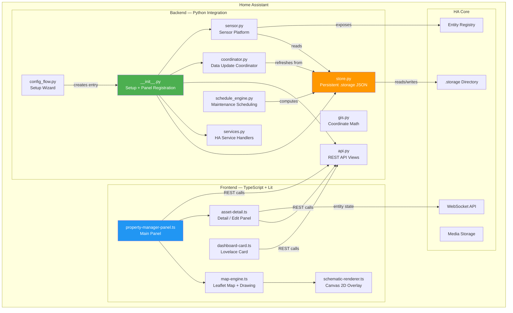
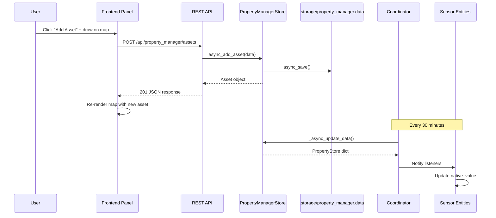
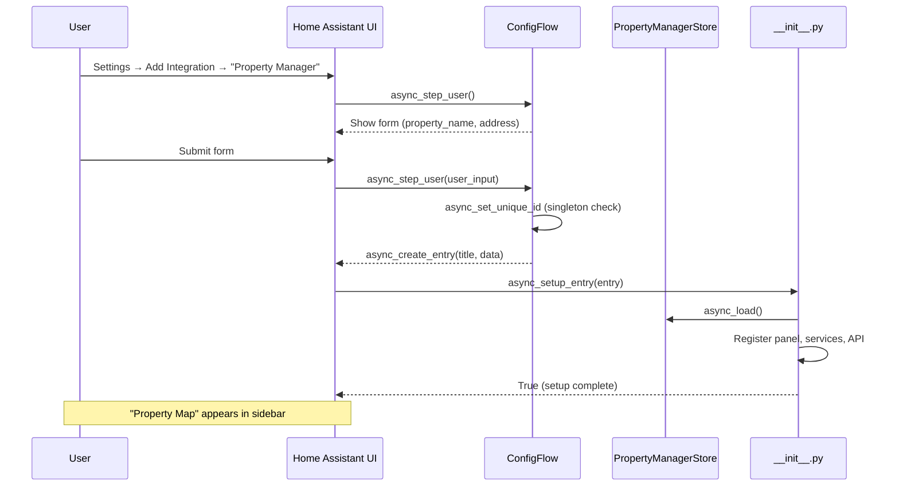
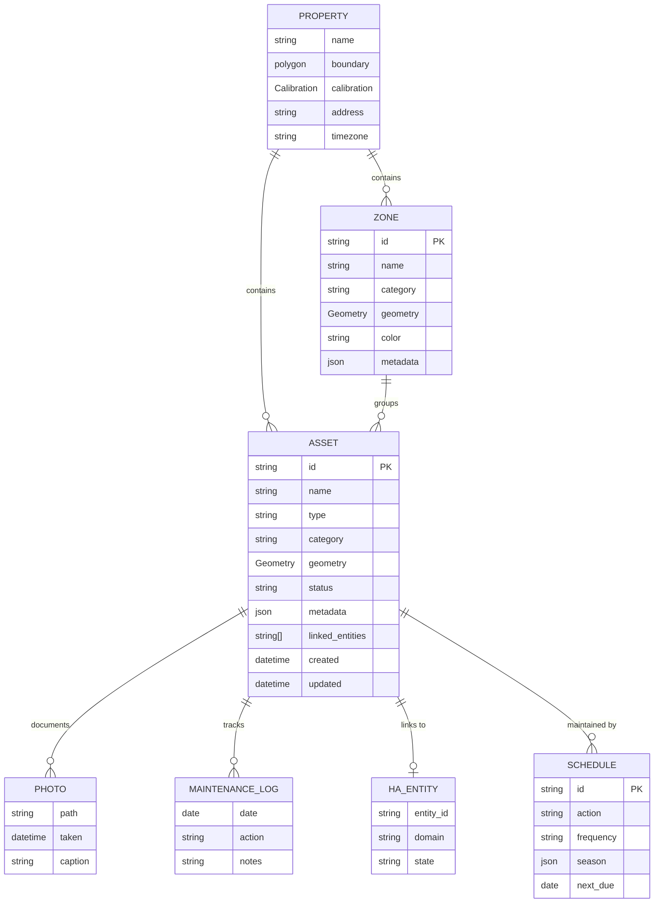

# Property Manager for Home Assistant

An interactive property map inside Home Assistant where homeowners can plot, track, and monitor everything on their property — fences, trees, sprinkler zones, pest traps, paths, garden beds, utility lines, lighting, and more.

**GIS-lite purpose-built for residential properties, deeply integrated with Home Assistant.**

> Think: architectural site plan meets smart home — a spatial layer for your home automation that ties physical location to monitoring, maintenance, and HA entity control.


<!-- TODO: Replace with actual screenshots of satellite view, schematic view, detail panel, and dashboard card -->

---

## Table of Contents

- [Features](#features)
- [Architecture](#architecture)
- [Data Model](#data-model)
- [Installation](#installation)
- [Configuration](#configuration)
- [Asset Categories](#asset-categories)
- [API Reference](#api-reference)
- [Development Setup](#development-setup)
- [Testing](#testing)
- [Contributing](#contributing)
- [License](#license)

---

## Features

- **Interactive Leaflet map** with satellite (OpenStreetMap) and schematic (Canvas 2D) view modes
- **Asset tracking** with 14 built-in categories including structures, landscaping, water/irrigation, utilities, pest control, paths, lighting, recreation, vehicles, septic systems, wells, mini-splits, traditional AC, and custom
- **Draw tools** — place points, draw lines, and draw polygons directly on the map
- **HA entity linking** — connect map assets to Home Assistant entities for live state display and inline control
- **Maintenance scheduling** with seasonal awareness, frequency parsing, and overdue tracking
- **Two-point scale calibration** for spatially accurate measurements
- **GeoJSON parcel import** for setting your property boundary from county GIS data
- **Canvas 2D schematic renderer** with category-based color palette and SVG export
- **Dashboard card** (Lovelace) showing asset counts and attention items
- **Sensor entities** — `sensor.property_assets` (total count) and `sensor.property_attention_needed` (overdue/attention count)
- **Full REST API** for frontend-backend communication
- **HA services** for automation integration (add/update/remove assets, log maintenance, attach photos)

---

## Architecture

### System Architecture

How the backend, frontend, Home Assistant core, and storage layer interact:



### Data Flow

User action through frontend to API to storage and back to HA entities:



### Config Flow



---

## Data Model



**Geometry types:** Point (traps, trees, valves), LineString (fences, pipes, paths), Polygon (decks, garden beds, zones).

**Storage format:** All data is persisted as a single JSON file in Home Assistant's `.storage/property_manager.data` — no external database required. Data is backed up automatically with HA snapshots.

---

## Installation

### HACS (Recommended)

1. Open **HACS** in Home Assistant
2. Go to **Integrations** → **Custom Repositories**
3. Add this repository URL and select **Integration** as the category
4. Click **Install**
5. Restart Home Assistant

### Manual Installation

1. Copy the `custom_components/property_manager/` directory into your Home Assistant `custom_components/` directory
2. Build the frontend (see [Development Setup](#development-setup)) — the built JS must be at `custom_components/property_manager/frontend/property-manager-panel.js`
3. Restart Home Assistant

### Initial Setup

1. Go to **Settings** → **Devices & Services** → **Add Integration**
2. Search for **Property Manager**
3. Enter your property name and optional address
4. Click **Submit** — the **Property Map** panel appears in your sidebar
5. Open the map and start adding assets

---

## Configuration

### Integration Options

| Option | Description | Default |
|--------|-------------|---------|
| Property Name | Display name for your property | "Home" |
| Address | Optional street address (for reference) | "" |

### Property Settings (via API/Service)

After setup, update property settings via the `property_manager.update_property` service or `PUT /api/property_manager/property`:

| Field | Description |
|-------|-------------|
| `name` | Property display name |
| `boundary` | Array of `[lat, lng]` coordinate pairs defining the property boundary |
| `calibration` | Two-point calibration: `{ point_a, point_b, distance_meters }` |
| `address` | Street address |
| `timezone` | IANA timezone string (e.g., `America/Los_Angeles`) |

### Lovelace Dashboard Card

Add the Property Manager summary card to any dashboard:

```yaml
type: custom:property-manager-card
title: My Property  # optional
```

---

## Asset Categories

| Category | Key | Icon | Color | Examples |
|----------|-----|------|-------|----------|
| Structures | `structures` | `mdi:home-outline` | Gray (#78909C) | Deck, shed, fence, retaining wall, pergola |
| Landscaping | `landscaping` | `mdi:tree` | Green (#66BB6A) | Trees, garden beds, lawn zones, hedges |
| Water / Irrigation | `water` | `mdi:water` | Blue (#42A5F5) | Sprinkler heads, valves, hose bibs, drainage |
| Utilities | `utilities` | `mdi:flash` | Orange (#FFA726) | Electrical outlets, gas lines, junction boxes |
| Pest Control | `pest_control` | `mdi:bug` | Yellow (#FDD835) | Wasp traps, ant bait, rodent stations |
| Paths & Access | `paths_access` | `mdi:walk` | Brown (#A1887F) | Walkways, driveways, gates, stairs |
| Lighting | `lighting` | `mdi:lightbulb-outline` | Amber (#FFB300) | Outdoor lights, solar stakes, motion sensors |
| Recreation | `recreation` | `mdi:basketball` | Purple (#AB47BC) | Play structures, fire pit, pool, trampoline |
| Vehicles | `vehicles` | `mdi:car` | Slate (#78909C) | Parking spots, EV charger, garage zones |
| Septic Systems | `septic` | `mdi:pipe` | Brown (#8D6E63) | Septic tanks, drain fields, distribution boxes |
| Well / Water Well | `well_water` | `mdi:water-well` | Deep Blue (#0288D1) | Well heads, pressure tanks, well caps |
| Mini-Split (Outdoor) | `hvac_mini_split` | `mdi:hvac` | Teal (#26A69A) | Outdoor mini-split condenser units |
| AC Condenser | `hvac_ac` | `mdi:air-conditioner` | Indigo (#5C6BC0) | Traditional AC outdoor condenser units |
| Custom | `custom` | `mdi:map-marker` | Gray (#9E9E9E) | Anything else — user-defined |

---

## API Reference

All endpoints require Home Assistant authentication (long-lived access token or session).

### Property Data

| Endpoint | Method | Description |
|----------|--------|-------------|
| `/api/property_manager/data` | `GET` | Full property store (property + all assets + all zones) |
| `/api/property_manager/property` | `GET` | Property-level settings |
| `/api/property_manager/property` | `PUT` | Update property settings |
| `/api/property_manager/categories` | `GET` | Asset category definitions (names, icons, colors) |

### Assets

| Endpoint | Method | Description |
|----------|--------|-------------|
| `/api/property_manager/assets` | `GET` | List all assets (optional `?category=` filter) |
| `/api/property_manager/assets` | `POST` | Create a new asset |
| `/api/property_manager/assets/{asset_id}` | `GET` | Get a single asset |
| `/api/property_manager/assets/{asset_id}` | `PUT` | Update an asset |
| `/api/property_manager/assets/{asset_id}` | `DELETE` | Delete an asset |

### Zones

| Endpoint | Method | Description |
|----------|--------|-------------|
| `/api/property_manager/zones` | `GET` | List all zones |
| `/api/property_manager/zones` | `POST` | Create a new zone |
| `/api/property_manager/zones/{zone_id}` | `GET` | Get a single zone |
| `/api/property_manager/zones/{zone_id}` | `PUT` | Update a zone |
| `/api/property_manager/zones/{zone_id}` | `DELETE` | Delete a zone |

### Maintenance & Photos

| Endpoint | Method | Description |
|----------|--------|-------------|
| `/api/property_manager/assets/{asset_id}/maintenance` | `GET` | List maintenance log entries |
| `/api/property_manager/assets/{asset_id}/maintenance` | `POST` | Add a maintenance log entry |
| `/api/property_manager/assets/{asset_id}/photos` | `GET` | List photos for an asset |
| `/api/property_manager/assets/{asset_id}/photos` | `POST` | Attach a photo to an asset |

### HA Services

| Service | Description | Required Fields |
|---------|-------------|----------------|
| `property_manager.add_asset` | Add a new asset | `name` |
| `property_manager.update_asset` | Update an existing asset | `asset_id` |
| `property_manager.remove_asset` | Remove an asset | `asset_id` |
| `property_manager.add_zone` | Add a new zone | `name` |
| `property_manager.update_zone` | Update an existing zone | `zone_id` |
| `property_manager.remove_zone` | Remove a zone | `zone_id` |
| `property_manager.update_property` | Update property settings | (any property field) |
| `property_manager.log_maintenance` | Log maintenance for an asset | `asset_id`, `action` |
| `property_manager.add_photo` | Attach a photo to an asset | `asset_id`, `path` |

---

## Development Setup

### Prerequisites

- Python 3.12+
- Node.js 18+ and npm
- Git

### Backend (Python)

```bash
# Clone the repository
git clone https://github.com/gemisis/ha-property-manager.git
cd ha-property-manager

# Create and activate a virtual environment
python -m venv .venv
source .venv/bin/activate  # macOS/Linux
# .venv\Scripts\activate   # Windows

# Install the package with dev dependencies
pip install -e ".[dev]"
```

### Frontend (TypeScript + Lit)

```bash
cd frontend

# Install Node dependencies
npm install

# Development build with file watching
npm run dev

# Production build (minified, output to custom_components/property_manager/frontend/)
npm run build

# Type-check only (no emit)
npm run typecheck
```

The Rollup build outputs the bundled panel to:
`custom_components/property_manager/frontend/property-manager-panel.js`

### Pre-commit Hooks

```bash
pip install pre-commit
pre-commit install
```

This enables automatic linting (Ruff) and formatting on every commit.

### Project Structure

```
ha-property-manager/
├── custom_components/property_manager/   # HA integration (Python)
│   ├── __init__.py          # Integration setup, panel + service registration
│   ├── config_flow.py       # Setup wizard (singleton config entry)
│   ├── const.py             # Constants, categories, statuses
│   ├── models.py            # Dataclass models (Asset, Zone, Property, etc.)
│   ├── store.py             # Persistent .storage JSON layer
│   ├── services.py          # HA service handlers (CRUD + maintenance + photos)
│   ├── api.py               # REST API views for frontend communication
│   ├── sensor.py            # Sensor entities (asset count, attention count)
│   ├── coordinator.py       # DataUpdateCoordinator (30-min refresh)
│   ├── gis.py               # Haversine distance, polygon area, GeoJSON import
│   ├── schedule_engine.py   # Frequency parsing, seasonal logic, overdue detection
│   ├── services.yaml        # HA service definitions for UI
│   ├── strings.json         # Localization strings
│   ├── translations/en.json # English translations
│   ├── manifest.json        # Integration manifest
│   └── frontend/            # Built JS output (.gitignored)
├── frontend/                # TypeScript + Lit source
│   ├── src/
│   │   ├── property-manager-panel.ts  # Main panel (toolbar, map, detail)
│   │   ├── map-engine.ts             # Leaflet wrapper + drawing tools
│   │   ├── schematic-renderer.ts     # Canvas 2D renderer + SVG export
│   │   ├── asset-detail.ts           # Asset detail/edit side panel
│   │   ├── dashboard-card.ts         # Lovelace summary card
│   │   ├── models.ts                 # TypeScript type definitions
│   │   └── styles.ts                 # Shared CSS + category color maps
│   ├── package.json
│   ├── rollup.config.js
│   └── tsconfig.json
├── tests/                   # pytest test suite (50 tests)
│   ├── conftest.py          # Shared fixtures
│   ├── test_models.py       # Data model round-trip tests
│   ├── test_store.py        # Store CRUD + serialization tests
│   ├── test_schedule.py     # Scheduling engine tests
│   ├── test_gis.py          # GIS utility tests
│   └── test_services.py     # Service constant tests
├── hacs.json                # HACS distribution config
├── pyproject.toml           # Python project config (pytest, ruff, mypy)
├── .pre-commit-config.yaml  # Pre-commit hook config
└── PLAN.md                  # Full design specification
```

---

## Testing

```bash
# Activate the virtual environment
source .venv/bin/activate

# Run all tests with verbose output
pytest -v

# Run a specific test file
pytest tests/test_models.py -v

# Run tests with coverage
pytest --cov=custom_components.property_manager --cov-report=term-missing

# Lint Python code
ruff check custom_components/ tests/

# Format Python code
ruff format custom_components/ tests/

# Type-check Python
mypy custom_components/property_manager/

# Type-check frontend
cd frontend && npm run typecheck
```

---

## Contributing

Contributions are welcome! Here's how to get started:

1. **Fork** the repository
2. **Create a branch** for your feature or fix: `git checkout -b feature/my-feature`
3. **Set up the dev environment** (see [Development Setup](#development-setup))
4. **Make your changes** — ensure all tests pass and linting is clean
5. **Add tests** for any new functionality
6. **Submit a pull request** with a clear description of the changes

### Code Style

- **Python:** Follows [Ruff](https://github.com/astral-sh/ruff) defaults with line length 100. Run `ruff check --fix` and `ruff format` before committing.
- **TypeScript:** Standard TypeScript strict mode. Use Lit conventions for custom elements.
- **Commits:** Use clear, descriptive commit messages.

### Adding a New Asset Category

1. Add the category constant to `const.py`
2. Add the category definition (name, icon, color) to `ASSET_CATEGORIES` in `const.py`
3. Add the category to `services.yaml` selector options
4. Add the color to `CATEGORY_COLORS` in `frontend/src/styles.ts`

---

## License

[MIT](LICENSE)
